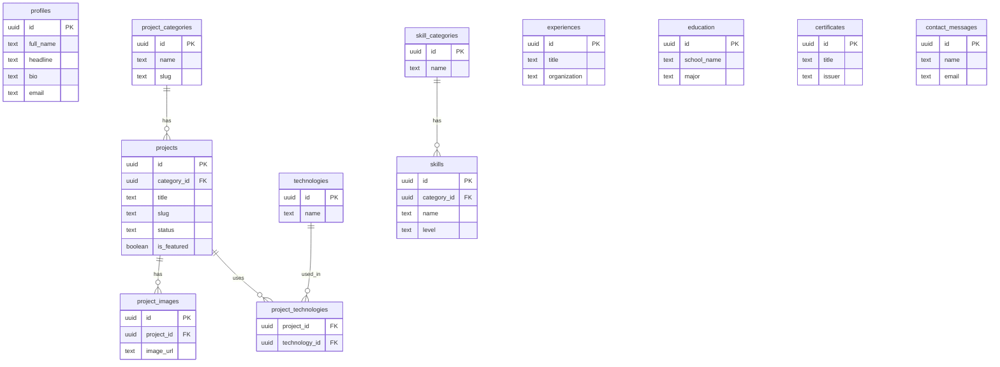

# Product Requirements Document (PRD)

# Website Portofolio Umum Bidang IT

**Nama Proyek:** Website Portofolio IT Umum  
**Pemilik:** Muhammad Syaban Alfain  
**Versi Dokumen:** 1.0  
**Tanggal:** 24 Juni 2026  
**Status:** Draft  
**Tech Stack Utama:** Next.js, Supabase, Tailwind CSS  
**Referensi Desain:** https://ikhsanaryaaa.xyz/

---

## 1. Ringkasan Proyek

Website portofolio ini dibuat sebagai media personal branding untuk menampilkan kemampuan, pengalaman, project, sertifikat, dan dokumentasi kerja di bidang teknologi informasi secara umum. Portofolio ini tidak hanya difokuskan untuk posisi IT Support, tetapi juga dapat digunakan untuk bidang IT lainnya seperti Web Development, Network Support, System Administration, Database, Cloud/Server, Cybersecurity dasar, dan Technical Documentation.

Website akan dibangun menggunakan **Next.js** sebagai frontend sekaligus backend melalui App Router, Server Components, Server Actions, dan Route Handlers. Database menggunakan **Supabase** yang menyediakan PostgreSQL, Authentication, Storage, dan Row Level Security. Desain website mengambil inspirasi dari struktur dan gaya portofolio modern pada website `ikhsanaryaaa.xyz`, yaitu tampilan minimalis, profesional, navigasi sederhana, hero section yang kuat, daftar project, expertise/skill, about, contact, dan footer.

---

## 2. Tujuan Proyek

Tujuan utama dari website portofolio ini adalah:

1. Menampilkan identitas profesional sebagai talenta IT umum.
2. Menampilkan project IT secara rapi dan mudah dipahami oleh HRD, recruiter, client, atau calon partner kerja.
3. Menyediakan halaman skill yang terbagi berdasarkan bidang IT.
4. Menyediakan halaman detail project lengkap dengan deskripsi, teknologi, masalah, solusi, screenshot, dan link repository/demo.
5. Menyediakan fitur download CV.
6. Menyediakan form kontak agar pengunjung dapat menghubungi pemilik portofolio.
7. Menyediakan admin panel sederhana untuk mengelola konten portofolio tanpa harus mengubah kode secara manual.

---

## 3. Latar Belakang

Portofolio digital menjadi salah satu media penting untuk menunjukkan kemampuan seseorang di bidang IT. CV saja sering kali belum cukup untuk membuktikan kemampuan teknis, karena recruiter atau client membutuhkan bukti nyata berupa project, dokumentasi, pengalaman, dan hasil kerja. Oleh karena itu, diperlukan sebuah website portofolio yang dapat memuat identitas, kemampuan, project, sertifikat, pengalaman, serta informasi kontak secara profesional.

Karena bidang IT sangat luas, website ini dirancang tidak hanya untuk IT Support, tetapi juga fleksibel untuk menampilkan kemampuan di berbagai bidang seperti frontend development, backend development, database, networking, server, cloud, cybersecurity dasar, dan technical support.

---

## 4. Target Pengguna

### 4.1 Pengunjung Publik

Pengunjung publik adalah orang yang mengakses website tanpa login. Contohnya:

- HRD atau recruiter.
- Client freelance.
- Partner project.
- Dosen/pembimbing.
- Teman komunitas IT.
- Pengunjung umum.

### 4.2 Admin

Admin adalah pemilik portofolio yang dapat login untuk mengelola isi website, seperti project, skill, pengalaman, sertifikat, CV, dan pesan masuk.

---

## 5. Persona Pengguna

### 5.1 Recruiter / HRD

Recruiter ingin melihat profil, skill, pengalaman, dan project secara cepat. Mereka membutuhkan tampilan yang rapi, mudah dibaca, dan memiliki informasi kontak yang jelas.

### 5.2 Client Freelance

Client ingin melihat project yang pernah dibuat, teknologi yang digunakan, dan kemampuan pemilik portofolio untuk menyelesaikan masalah.

### 5.3 Admin / Pemilik Website

Admin ingin mengelola konten portofolio secara mudah tanpa harus mengedit kode setiap kali ingin menambah project, sertifikat, atau pengalaman baru.

---

## 6. Ruang Lingkup Proyek

### 6.1 Ruang Lingkup MVP

Fitur yang wajib ada pada versi awal:

1. Landing page / Home.
2. Halaman Portfolio / Projects.
3. Halaman Detail Project.
4. Halaman Expertise / Skills.
5. Halaman About.
6. Halaman Contact.
7. Fitur download CV.
8. Form kontak.
9. Admin login.
10. Admin dashboard sederhana.
11. CRUD project.
12. CRUD skill.
13. CRUD pengalaman.
14. CRUD sertifikat.
15. Upload gambar project dan file CV menggunakan Supabase Storage.

### 6.2 Ruang Lingkup Pengembangan Lanjutan

Fitur tambahan yang dapat dikembangkan setelah MVP:

1. Blog artikel IT.
2. Dark mode / light mode toggle.
3. Multi-language Indonesia dan Inggris.
4. Statistik pengunjung.
5. Integrasi email otomatis.
6. Integrasi WhatsApp.
7. Filter project berdasarkan teknologi.
8. Search project.
9. Testimonial.
10. Halaman service/freelance.
11. Sitemap otomatis.
12. Optimasi SEO lanjutan.

---

## 7. Konsep Portofolio

Website ini mengusung konsep **General IT Portfolio**, bukan hanya IT Support. Artinya, isi portofolio dapat mencakup beberapa bidang IT, antara lain:

1. **IT Support & Helpdesk**
   - Troubleshooting Windows/Linux.
   - Instalasi software dan driver.
   - Printer sharing.
   - Remote support.
   - Dokumentasi SOP.

2. **Web Development**
   - Next.js.
   - React.
   - REST API.
   - Dashboard admin.
   - Sistem informasi berbasis web.

3. **Backend & Database**
   - Supabase.
   - PostgreSQL.
   - Prisma / query SQL.
   - Authentication.
   - API endpoint.

4. **Network & Server**
   - Mikrotik basic.
   - LAN.
   - IP Addressing.
   - DNS, DHCP, NAT.
   - Ubuntu Server.
   - VPS deployment.

5. **Cybersecurity Dasar**
   - Basic firewall.
   - User access control.
   - Backup.
   - Security checklist.

6. **Technical Documentation**
   - SOP.
   - Troubleshooting guide.
   - Dokumentasi instalasi.
   - Laporan project.

---

## 8. Referensi Desain

Desain website mengambil inspirasi dari website `https://ikhsanaryaaa.xyz/`, khususnya pada bagian:

1. Navigasi sederhana: Home, Portfolio, Expertise, About, Contact.
2. Hero section dengan status ketersediaan kerja.
3. Judul besar dan tagline singkat.
4. Tombol call-to-action seperti Recent Works dan Download CV.
5. Statistik singkat seperti jumlah pengalaman dan project.
6. Section Recent Works untuk menampilkan project terbaru.
7. Section Core Capabilities untuk menampilkan kemampuan utama.
8. Halaman Portfolio dengan filter kategori.
9. Halaman Expertise dengan pengelompokan skill.
10. Halaman About dengan profil, pendidikan, dan pengalaman kerja.
11. Halaman Contact dengan email, WhatsApp, dan social links.
12. Footer berisi navigasi dan link sosial.

Catatan: desain hanya dijadikan inspirasi struktur dan gaya visual. Asset, konten, teks, gambar, dan identitas tetap dibuat khusus untuk portofolio milik Muhammad Syaban Alfain.

---

## 9. Identitas Visual

### 9.1 Gaya Desain

Gaya desain yang digunakan:

- Modern.
- Minimalis.
- Profesional.
- Clean layout.
- Banyak ruang kosong agar konten mudah dibaca.
- Fokus pada typography dan card project.
- Cocok untuk bidang IT umum.

### 9.2 Warna

Rekomendasi warna:

| Elemen | Warna |
|---|---|
| Background utama | #050816 / #0B1120 |
| Background card | #111827 / #1F2937 |
| Text utama | #F9FAFB |
| Text sekunder | #9CA3AF |
| Accent biru | #38BDF8 |
| Accent ungu | #8B5CF6 |
| Border | #374151 |
| Success/status | #22C55E |

### 9.3 Font

Rekomendasi font:

- Inter.
- Poppins.
- Geist Sans.
- Plus Jakarta Sans.

### 9.4 Komponen Visual

Komponen utama:

- Navbar sticky.
- Badge status “Available for Work”.
- Hero title besar.
- Card project.
- Card skill.
- Tag teknologi.
- Button primary dan secondary.
- Section heading besar.
- Footer sederhana.

---

## 10. Struktur Navigasi

Navigasi utama website:

```text
Home | Portfolio | Expertise | About | Contact
```

Navigasi tambahan untuk admin:

```text
Admin Login | Dashboard | Projects | Skills | Experiences | Certificates | Messages | Settings
```

---

## 11. Struktur Halaman Public

### 11.1 Home Page `/`

Home page adalah halaman utama yang pertama kali dilihat oleh pengunjung.

#### Section Home Page

1. Navbar.
2. Hero section.
3. Quick stats.
4. Recent works.
5. Core capabilities.
6. Short about.
7. Call-to-action contact.
8. Footer.

#### Konten Hero

Contoh teks:

```text
Available for Work

Muhammad Syaban Alfain
General IT Portfolio

Membangun solusi digital, menangani troubleshooting, mengelola jaringan dasar, server, database, dan sistem informasi berbasis web.
```

#### Tombol CTA

- Lihat Project.
- Download CV.
- Hubungi Saya.

#### Statistik Singkat

Contoh:

| Statistik | Keterangan |
|---|---|
| 10+ | Project / dokumentasi IT |
| 5+ | Bidang skill IT |
| 3+ | Tools server & network |
| Open | Freelance / Internship / Full-time |

---

### 11.2 Portfolio Page `/portfolio`

Halaman ini menampilkan seluruh project yang pernah dibuat atau didokumentasikan.

#### Fitur

1. Menampilkan daftar project.
2. Filter berdasarkan kategori.
3. Filter berdasarkan teknologi.
4. Menampilkan card project.
5. Tombol lihat detail.
6. Tombol demo atau GitHub jika tersedia.

#### Kategori Project

Kategori yang disarankan:

- All.
- Web Development.
- IT Support.
- Network.
- Server.
- Database.
- Documentation.
- Cybersecurity Basic.

#### Card Project

Isi card project:

- Thumbnail.
- Nama project.
- Kategori.
- Deskripsi singkat.
- Teknologi.
- Tahun.
- Link detail.

---

### 11.3 Project Detail Page `/portfolio/[slug]`

Halaman detail project digunakan untuk menjelaskan project secara lengkap.

#### Informasi Project

1. Judul project.
2. Kategori project.
3. Deskripsi singkat.
4. Latar belakang masalah.
5. Tujuan project.
6. Teknologi yang digunakan.
7. Fitur utama.
8. Alur kerja sistem.
9. Screenshot / dokumentasi.
10. Tantangan dan solusi.
11. Hasil akhir.
12. Link demo.
13. Link repository GitHub.

#### Contoh Project

```text
Judul: Sistem Informasi Sekolah
Kategori: Web Development
Teknologi: Next.js, Supabase, Tailwind CSS
Deskripsi: Website sistem informasi sekolah untuk mengelola data siswa, guru, kelas, absensi, nilai, dan laporan.
```

---

### 11.4 Expertise Page `/expertise`

Halaman ini menampilkan kemampuan teknis berdasarkan kategori.

#### Kategori Skill

1. Frontend Development.
2. Backend Development.
3. Database.
4. IT Support.
5. Network.
6. Server & Deployment.
7. Tools.
8. Documentation.

#### Level Skill

Level skill yang digunakan:

- Fundamental.
- Intermediate.
- Advanced.

#### Contoh Skill

| Kategori | Skill | Level |
|---|---|---|
| Frontend | HTML, CSS, JavaScript | Intermediate |
| Frontend | React, Next.js | Intermediate |
| Backend | API Route, Server Action | Fundamental |
| Database | PostgreSQL, Supabase | Fundamental |
| IT Support | Troubleshooting Windows | Intermediate |
| Network | IP Address, DNS, DHCP | Intermediate |
| Server | Ubuntu Server, Nginx | Fundamental |
| Tools | Git, GitHub, VS Code | Intermediate |

---

### 11.5 About Page `/about`

Halaman About berisi informasi personal dan perjalanan belajar/karier.

#### Section About

1. Foto profil.
2. Nama lengkap.
3. Role singkat.
4. Deskripsi diri.
5. Pendidikan.
6. Pengalaman.
7. Sertifikat.
8. Minat bidang IT.

#### Contoh Deskripsi

```text
Saya memiliki minat di bidang teknologi informasi secara umum, mulai dari IT Support, Web Development, Database, Jaringan, Server, hingga dokumentasi teknis. Saya terbiasa mempelajari masalah secara bertahap, membuat solusi, dan mendokumentasikan proses kerja agar mudah dipahami kembali.
```

---

### 11.6 Contact Page `/contact`

Halaman Contact digunakan agar pengunjung dapat menghubungi pemilik portofolio.

#### Informasi Kontak

- Email.
- WhatsApp.
- GitHub.
- LinkedIn.
- Instagram profesional jika diperlukan.
- Lokasi umum: Indonesia.

#### Form Kontak

Field form:

1. Nama.
2. Email.
3. Subjek.
4. Pesan.

#### Validasi Form

- Nama wajib diisi.
- Email wajib diisi dan harus valid.
- Pesan minimal 10 karakter.
- Jika berhasil, tampilkan pesan sukses.
- Jika gagal, tampilkan pesan error.

---

## 12. Struktur Halaman Admin

### 12.1 Admin Login `/admin/login`

Admin login menggunakan Supabase Auth.

#### Field

- Email.
- Password.

#### Validasi

- Email wajib diisi.
- Password wajib diisi.
- Jika login gagal, tampilkan pesan error.
- Jika login berhasil, redirect ke dashboard admin.

---

### 12.2 Admin Dashboard `/admin/dashboard`

Dashboard menampilkan ringkasan data.

#### Informasi Dashboard

1. Total project.
2. Total skill.
3. Total pengalaman.
4. Total sertifikat.
5. Total pesan masuk.
6. Project terbaru.
7. Pesan terbaru.

---

### 12.3 Manage Projects `/admin/projects`

Fitur untuk mengelola project.

#### Fitur

- Tambah project.
- Edit project.
- Hapus project.
- Publish/unpublish project.
- Upload thumbnail.
- Upload gallery screenshot.
- Atur kategori.
- Atur teknologi.
- Atur featured project.

---

### 12.4 Manage Skills `/admin/skills`

Fitur untuk mengelola daftar skill.

#### Fitur

- Tambah skill.
- Edit skill.
- Hapus skill.
- Atur kategori skill.
- Atur level skill.
- Atur urutan tampil.

---

### 12.5 Manage Experiences `/admin/experiences`

Fitur untuk mengelola pengalaman.

#### Fitur

- Tambah pengalaman.
- Edit pengalaman.
- Hapus pengalaman.
- Atur tanggal mulai dan selesai.
- Atur tipe pengalaman: kerja, freelance, praktik, organisasi, magang.

---

### 12.6 Manage Certificates `/admin/certificates`

Fitur untuk mengelola sertifikat.

#### Fitur

- Tambah sertifikat.
- Edit sertifikat.
- Hapus sertifikat.
- Upload file/gambar sertifikat.
- Isi nama penerbit.
- Isi tanggal terbit.
- Tambah link validasi sertifikat jika ada.

---

### 12.7 Manage Messages `/admin/messages`

Fitur untuk melihat pesan yang dikirim melalui form kontak.

#### Fitur

- Lihat daftar pesan.
- Lihat detail pesan.
- Tandai sudah dibaca.
- Hapus pesan.

---

### 12.8 Settings `/admin/settings`

Fitur untuk mengelola pengaturan website.

#### Data Settings

- Nama pemilik.
- Tagline.
- Deskripsi singkat.
- Email.
- WhatsApp.
- Link GitHub.
- Link LinkedIn.
- Link CV.
- Status available for work.

---

## 13. Kebutuhan Fungsional

| Kode | Kebutuhan | Prioritas |
|---|---|---|
| FR-001 | Pengunjung dapat melihat halaman Home | High |
| FR-002 | Pengunjung dapat melihat daftar project | High |
| FR-003 | Pengunjung dapat melihat detail project | High |
| FR-004 | Pengunjung dapat memfilter project berdasarkan kategori | Medium |
| FR-005 | Pengunjung dapat melihat daftar skill | High |
| FR-006 | Pengunjung dapat melihat halaman About | High |
| FR-007 | Pengunjung dapat mengunduh CV | High |
| FR-008 | Pengunjung dapat mengirim pesan melalui form kontak | High |
| FR-009 | Admin dapat login | High |
| FR-010 | Admin dapat mengelola project | High |
| FR-011 | Admin dapat mengelola skill | High |
| FR-012 | Admin dapat mengelola pengalaman | Medium |
| FR-013 | Admin dapat mengelola sertifikat | Medium |
| FR-014 | Admin dapat melihat pesan masuk | Medium |
| FR-015 | Admin dapat mengelola pengaturan website | Medium |
| FR-016 | Sistem dapat menyimpan gambar project di Supabase Storage | High |
| FR-017 | Sistem dapat menyimpan file CV di Supabase Storage | Medium |
| FR-018 | Sistem dapat menampilkan project featured di halaman Home | High |
| FR-019 | Sistem dapat menampilkan status available for work | Medium |
| FR-020 | Sistem dapat menghasilkan halaman SEO-friendly | High |

---

## 14. Kebutuhan Non-Fungsional

| Kode | Kebutuhan | Keterangan |
|---|---|---|
| NFR-001 | Responsive | Website harus nyaman diakses dari desktop, tablet, dan mobile |
| NFR-002 | Performance | Halaman utama harus ringan dan cepat dimuat |
| NFR-003 | SEO | Setiap halaman penting memiliki title, description, OG image, dan metadata |
| NFR-004 | Security | Admin route harus dilindungi authentication |
| NFR-005 | Database Security | Supabase RLS harus diaktifkan untuk tabel sensitif |
| NFR-006 | Accessibility | Kontras warna dan struktur heading harus jelas |
| NFR-007 | Maintainability | Struktur folder harus rapi dan mudah dikembangkan |
| NFR-008 | Scalability | Konten project/skill dapat ditambah tanpa mengubah kode utama |
| NFR-009 | Backup | Data penting perlu dapat diekspor atau dicadangkan |
| NFR-010 | Compatibility | Website berjalan baik di Chrome, Edge, Firefox, dan browser mobile modern |

---

## 15. Arsitektur Sistem

### 15.1 Arsitektur Umum

```text
User Browser
    ↓
Next.js App Router
    ↓
Server Components / Server Actions / Route Handlers
    ↓
Supabase Client
    ↓
Supabase PostgreSQL + Auth + Storage
```

### 15.2 Frontend

Frontend menggunakan:

- Next.js App Router.
- React Components.
- Tailwind CSS.
- TypeScript.
- Responsive layout.
- Optional animation menggunakan Framer Motion.

### 15.3 Backend

Backend menggunakan fitur Next.js:

- Server Actions untuk submit form dan mutasi data.
- Route Handlers untuk endpoint API jika diperlukan.
- Middleware untuk proteksi halaman admin.
- Supabase server client untuk query data aman.

### 15.4 Database

Database menggunakan Supabase PostgreSQL.

### 15.5 Storage

Supabase Storage digunakan untuk:

- Thumbnail project.
- Gallery project.
- File CV.
- Gambar sertifikat.
- Foto profil.

---

## 16. Rancangan Database

### 16.1 Tabel `profiles`

Menyimpan profil utama pemilik website.

| Field | Tipe | Keterangan |
|---|---|---|
| id | uuid | Primary key |
| full_name | text | Nama lengkap |
| headline | text | Role singkat |
| bio | text | Deskripsi diri |
| location | text | Lokasi umum |
| email | text | Email |
| phone | text | Nomor WhatsApp |
| github_url | text | Link GitHub |
| linkedin_url | text | Link LinkedIn |
| instagram_url | text | Link Instagram |
| cv_url | text | Link file CV |
| profile_image_url | text | Foto profil |
| is_available | boolean | Status available for work |
| created_at | timestamptz | Waktu dibuat |
| updated_at | timestamptz | Waktu diubah |

---

### 16.2 Tabel `project_categories`

Menyimpan kategori project.

| Field | Tipe | Keterangan |
|---|---|---|
| id | uuid | Primary key |
| name | text | Nama kategori |
| slug | text | Slug kategori |
| description | text | Deskripsi kategori |
| sort_order | int | Urutan tampil |
| created_at | timestamptz | Waktu dibuat |

Contoh data:

- Web Development.
- IT Support.
- Network.
- Server.
- Database.
- Documentation.
- Cybersecurity Basic.

---

### 16.3 Tabel `projects`

Menyimpan data project.

| Field | Tipe | Keterangan |
|---|---|---|
| id | uuid | Primary key |
| category_id | uuid | Relasi ke project_categories |
| title | text | Judul project |
| slug | text | Slug URL |
| short_description | text | Deskripsi singkat |
| problem | text | Masalah/latar belakang |
| solution | text | Solusi yang dibuat |
| content | text | Konten detail project |
| thumbnail_url | text | Thumbnail project |
| demo_url | text | Link demo |
| github_url | text | Link GitHub |
| year | int | Tahun project |
| status | text | draft/published |
| is_featured | boolean | Tampil di homepage |
| created_at | timestamptz | Waktu dibuat |
| updated_at | timestamptz | Waktu diubah |

---

### 16.4 Tabel `project_images`

Menyimpan gambar dokumentasi project.

| Field | Tipe | Keterangan |
|---|---|---|
| id | uuid | Primary key |
| project_id | uuid | Relasi ke projects |
| image_url | text | Link gambar |
| caption | text | Keterangan gambar |
| sort_order | int | Urutan gambar |
| created_at | timestamptz | Waktu dibuat |

---

### 16.5 Tabel `technologies`

Menyimpan daftar teknologi/tools.

| Field | Tipe | Keterangan |
|---|---|---|
| id | uuid | Primary key |
| name | text | Nama teknologi |
| icon_url | text | Icon teknologi |
| created_at | timestamptz | Waktu dibuat |

Contoh:

- Next.js.
- React.
- Supabase.
- PostgreSQL.
- Tailwind CSS.
- Ubuntu Server.
- Mikrotik.
- GitHub.
- Windows.

---

### 16.6 Tabel `project_technologies`

Pivot table antara projects dan technologies.

| Field | Tipe | Keterangan |
|---|---|---|
| project_id | uuid | Relasi ke projects |
| technology_id | uuid | Relasi ke technologies |

---

### 16.7 Tabel `skill_categories`

Menyimpan kategori skill.

| Field | Tipe | Keterangan |
|---|---|---|
| id | uuid | Primary key |
| name | text | Nama kategori skill |
| slug | text | Slug |
| description | text | Deskripsi |
| sort_order | int | Urutan tampil |

---

### 16.8 Tabel `skills`

Menyimpan daftar skill.

| Field | Tipe | Keterangan |
|---|---|---|
| id | uuid | Primary key |
| category_id | uuid | Relasi ke skill_categories |
| name | text | Nama skill |
| level | text | fundamental/intermediate/advanced |
| description | text | Deskripsi skill |
| icon_url | text | Icon |
| sort_order | int | Urutan tampil |
| created_at | timestamptz | Waktu dibuat |
| updated_at | timestamptz | Waktu diubah |

---

### 16.9 Tabel `experiences`

Menyimpan pengalaman kerja, praktik, freelance, organisasi, atau magang.

| Field | Tipe | Keterangan |
|---|---|---|
| id | uuid | Primary key |
| title | text | Posisi/peran |
| organization | text | Nama organisasi/perusahaan |
| type | text | work/freelance/internship/organization/project |
| start_date | date | Tanggal mulai |
| end_date | date | Tanggal selesai |
| is_current | boolean | Masih berjalan |
| description | text | Deskripsi pengalaman |
| created_at | timestamptz | Waktu dibuat |
| updated_at | timestamptz | Waktu diubah |

---

### 16.10 Tabel `education`

Menyimpan riwayat pendidikan.

| Field | Tipe | Keterangan |
|---|---|---|
| id | uuid | Primary key |
| school_name | text | Nama sekolah/kampus |
| major | text | Jurusan |
| start_year | int | Tahun mulai |
| end_year | int | Tahun selesai |
| description | text | Keterangan tambahan |
| created_at | timestamptz | Waktu dibuat |

---

### 16.11 Tabel `certificates`

Menyimpan data sertifikat.

| Field | Tipe | Keterangan |
|---|---|---|
| id | uuid | Primary key |
| title | text | Nama sertifikat |
| issuer | text | Penerbit sertifikat |
| issue_date | date | Tanggal terbit |
| credential_url | text | Link validasi |
| certificate_image_url | text | Gambar/file sertifikat |
| description | text | Deskripsi |
| created_at | timestamptz | Waktu dibuat |

---

### 16.12 Tabel `contact_messages`

Menyimpan pesan dari form kontak.

| Field | Tipe | Keterangan |
|---|---|---|
| id | uuid | Primary key |
| name | text | Nama pengirim |
| email | text | Email pengirim |
| subject | text | Subjek pesan |
| message | text | Isi pesan |
| is_read | boolean | Status dibaca |
| created_at | timestamptz | Waktu masuk |

---

### 16.13 Tabel `site_settings`

Menyimpan pengaturan umum website.

| Field | Tipe | Keterangan |
|---|---|---|
| id | uuid | Primary key |
| key | text | Nama setting |
| value | text | Nilai setting |
| created_at | timestamptz | Waktu dibuat |
| updated_at | timestamptz | Waktu diubah |

---

## 17. Relasi Database



---

## 18. Supabase Security Rules

### 18.1 Public Read

Data yang boleh dibaca publik:

- profiles.
- published projects.
- project categories.
- project images.
- technologies.
- skills.
- experiences.
- education.
- certificates.
- site settings tertentu.

### 18.2 Admin Write Only

Data yang hanya boleh ditambah, diubah, atau dihapus oleh admin:

- projects.
- skills.
- experiences.
- education.
- certificates.
- site settings.
- uploaded files.

### 18.3 Contact Form

Pengunjung publik boleh membuat data baru pada tabel `contact_messages`, tetapi tidak boleh membaca semua pesan.

### 18.4 Row Level Security

RLS wajib diaktifkan untuk semua tabel yang digunakan. Policy dibuat berdasarkan kebutuhan:

- Public hanya boleh read data published.
- Public boleh insert pesan kontak.
- Admin boleh full access.

---

## 19. Struktur Folder Next.js

Rekomendasi struktur folder:

```text
src/
├── app/
│   ├── (public)/
│   │   ├── page.tsx
│   │   ├── portfolio/
│   │   │   ├── page.tsx
│   │   │   └── [slug]/page.tsx
│   │   ├── expertise/page.tsx
│   │   ├── about/page.tsx
│   │   └── contact/page.tsx
│   ├── admin/
│   │   ├── login/page.tsx
│   │   ├── dashboard/page.tsx
│   │   ├── projects/page.tsx
│   │   ├── skills/page.tsx
│   │   ├── experiences/page.tsx
│   │   ├── certificates/page.tsx
│   │   ├── messages/page.tsx
│   │   └── settings/page.tsx
│   ├── api/
│   │   ├── contact/route.ts
│   │   └── upload/route.ts
│   ├── layout.tsx
│   └── globals.css
├── components/
│   ├── public/
│   │   ├── Navbar.tsx
│   │   ├── Hero.tsx
│   │   ├── ProjectCard.tsx
│   │   ├── SkillCard.tsx
│   │   ├── Footer.tsx
│   │   └── CTASection.tsx
│   ├── admin/
│   │   ├── AdminSidebar.tsx
│   │   ├── AdminHeader.tsx
│   │   ├── ProjectForm.tsx
│   │   ├── SkillForm.tsx
│   │   └── DataTable.tsx
│   └── ui/
│       ├── Button.tsx
│       ├── Input.tsx
│       ├── Textarea.tsx
│       ├── Badge.tsx
│       └── Card.tsx
├── lib/
│   ├── supabase/
│   │   ├── client.ts
│   │   ├── server.ts
│   │   └── middleware.ts
│   ├── validations/
│   └── utils.ts
├── actions/
│   ├── contact.action.ts
│   ├── project.action.ts
│   ├── skill.action.ts
│   └── auth.action.ts
├── types/
│   └── database.types.ts
└── middleware.ts
```

---

## 20. Environment Variables

File `.env.local`:

```env
NEXT_PUBLIC_SUPABASE_URL="isi_url_supabase"
NEXT_PUBLIC_SUPABASE_ANON_KEY="isi_anon_key_supabase"
SUPABASE_SERVICE_ROLE_KEY="isi_service_role_key_jika_diperlukan_di_server"
NEXT_PUBLIC_SITE_URL="http://localhost:3000"
```

Catatan keamanan:

- `NEXT_PUBLIC_SUPABASE_ANON_KEY` boleh digunakan di client, tetapi tetap wajib menggunakan RLS.
- `SUPABASE_SERVICE_ROLE_KEY` tidak boleh dipakai di client.
- Jangan upload `.env.local` ke GitHub.

---

## 21. API / Server Actions

### 21.1 Contact Action

Digunakan untuk menyimpan pesan kontak ke tabel `contact_messages`.

Input:

- name.
- email.
- subject.
- message.

Output:

- success.
- error message jika gagal.

---

### 21.2 Project Actions

Digunakan oleh admin untuk:

- create project.
- update project.
- delete project.
- publish/unpublish project.
- upload thumbnail.

---

### 21.3 Skill Actions

Digunakan oleh admin untuk:

- create skill.
- update skill.
- delete skill.
- update sort order.

---

### 21.4 Auth Actions

Digunakan untuk:

- login admin.
- logout admin.
- get current user.
- protect admin route.

---

## 22. SEO Requirements

Setiap halaman utama wajib memiliki metadata:

### Home

- Title: Muhammad Syaban Alfain - General IT Portfolio.
- Description: Portofolio bidang IT yang menampilkan project web development, IT support, network, server, database, dan technical documentation.

### Portfolio

- Title: Portfolio - Muhammad Syaban Alfain.
- Description: Daftar project IT, dokumentasi, dan karya teknologi informasi.

### Project Detail

- Title: Nama Project - Muhammad Syaban Alfain.
- Description: Diambil dari short_description project.

### About

- Title: About - Muhammad Syaban Alfain.
- Description: Profil, pendidikan, pengalaman, dan minat bidang IT.

### Contact

- Title: Contact - Muhammad Syaban Alfain.
- Description: Hubungi Muhammad Syaban Alfain untuk kerja sama, project, freelance, atau peluang karier.

---

## 23. Content Requirements

### 23.1 Contoh Project Awal

Project awal yang dapat dimasukkan:

1. Website Portfolio IT.
2. Sistem Informasi Sekolah.
3. Sistem CBT / Ujian Online.
4. Website Pemilihan OSIS.
5. Dokumentasi Instalasi Windows dan Driver.
6. Simulasi Helpdesk Ticketing.
7. Konfigurasi Jaringan LAN.
8. Konfigurasi Mikrotik Basic.
9. Setup Ubuntu Server + Nginx.
10. Backup dan Restore PostgreSQL di VPS.

### 23.2 Contoh Skill Awal

Skill awal yang dapat dimasukkan:

- HTML.
- CSS.
- JavaScript.
- React.
- Next.js.
- Tailwind CSS.
- Supabase.
- PostgreSQL.
- Git.
- GitHub.
- Windows Troubleshooting.
- Linux Ubuntu.
- Ubuntu Server.
- Nginx.
- Mikrotik Basic.
- IP Addressing.
- DNS.
- DHCP.
- Remote Support.
- Technical Documentation.

---

## 24. User Flow

### 24.1 Pengunjung Melihat Project

```text
Pengunjung membuka website
↓
Melihat Home
↓
Klik tombol Lihat Project
↓
Masuk ke halaman Portfolio
↓
Filter kategori project
↓
Klik salah satu project
↓
Melihat detail project
↓
Klik GitHub/Demo atau Contact
```

### 24.2 Pengunjung Mengirim Pesan

```text
Pengunjung membuka Contact
↓
Mengisi nama, email, subjek, dan pesan
↓
Submit form
↓
Sistem validasi input
↓
Data tersimpan ke Supabase
↓
Pengunjung melihat pesan sukses
```

### 24.3 Admin Mengelola Project

```text
Admin membuka /admin/login
↓
Login menggunakan email dan password
↓
Masuk dashboard admin
↓
Pilih menu Projects
↓
Tambah/Edit project
↓
Upload thumbnail jika ada
↓
Simpan data
↓
Project tampil di halaman Portfolio jika status published
```

---

## 25. Wireframe Sederhana

### 25.1 Home Page

```text
+------------------------------------------------+
| Logo / Name       Home Portfolio Expertise ... |
+------------------------------------------------+
| Available for Work                             |
|                                                |
| Muhammad Syaban Alfain                         |
| General IT Portfolio                           |
|                                                |
| [Lihat Project] [Download CV]                  |
+------------------------------------------------+
| 10+ Projects | 5+ IT Fields | Open for Work    |
+------------------------------------------------+
| Recent Works                                   |
| [Project Card] [Project Card] [Project Card]   |
+------------------------------------------------+
| Core Capabilities                              |
| [Web Dev] [IT Support] [Network] [Server]      |
+------------------------------------------------+
| Let's Build Something Together                 |
| [Contact Me]                                   |
+------------------------------------------------+
| Footer                                         |
+------------------------------------------------+
```

### 25.2 Portfolio Page

```text
+------------------------------------------------+
| Portfolio                                      |
| All Web IT Support Network Server Database     |
+------------------------------------------------+
| [Project Card] [Project Card] [Project Card]   |
| [Project Card] [Project Card] [Project Card]   |
+------------------------------------------------+
```

### 25.3 Expertise Page

```text
+------------------------------------------------+
| Expertise                                      |
| Skill yang saya gunakan dalam berbagai bidang  |
+------------------------------------------------+
| Frontend Development                           |
| [HTML] [CSS] [React] [Next.js]                 |
+------------------------------------------------+
| Backend & Database                             |
| [Supabase] [PostgreSQL] [API]                  |
+------------------------------------------------+
| IT Support & Network                           |
| [Windows] [Mikrotik] [LAN] [Troubleshooting]   |
+------------------------------------------------+
```

---

## 26. UI Components

### 26.1 Navbar

Komponen navbar berisi:

- Logo/nama.
- Menu navigasi.
- Button Contact.
- Mobile hamburger menu.

### 26.2 Hero

Komponen hero berisi:

- Badge status.
- Judul besar.
- Tagline.
- CTA button.
- Visual dekoratif opsional.

### 26.3 Project Card

Project card berisi:

- Thumbnail.
- Category badge.
- Title.
- Short description.
- Tech tags.
- Link detail.

### 26.4 Skill Card

Skill card berisi:

- Icon.
- Nama skill.
- Level.
- Deskripsi singkat.

### 26.5 Contact Form

Contact form berisi:

- Input nama.
- Input email.
- Input subjek.
- Textarea pesan.
- Button submit.

---

## 27. Validasi Form

Gunakan validasi menggunakan Zod atau validasi manual.

### Contact Form

| Field | Rule |
|---|---|
| name | required, minimal 2 karakter |
| email | required, format email |
| subject | required, minimal 3 karakter |
| message | required, minimal 10 karakter |

### Project Form

| Field | Rule |
|---|---|
| title | required |
| slug | required, unique |
| category_id | required |
| short_description | required |
| status | draft/published |

---

## 28. Deployment

Rekomendasi deployment:

- Frontend/backend Next.js: Vercel.
- Database: Supabase.
- Storage: Supabase Storage.
- Domain: custom domain jika tersedia.

Alternatif deployment:

- VPS Ubuntu + Nginx reverse proxy.
- Coolify.
- Docker.

---

## 29. Testing

### 29.1 Functional Testing

Pengujian fitur:

1. Halaman Home dapat dibuka.
2. Halaman Portfolio dapat menampilkan daftar project.
3. Filter kategori project berjalan.
4. Detail project dapat dibuka.
5. Halaman Expertise menampilkan skill.
6. Form kontak berhasil mengirim pesan.
7. Admin dapat login.
8. Admin dapat tambah/edit/hapus project.
9. Upload gambar project berhasil.
10. CV dapat diunduh.

### 29.2 Responsive Testing

Perangkat yang diuji:

- Desktop 1920px.
- Laptop 1366px.
- Tablet 768px.
- Mobile 390px.

### 29.3 Security Testing

Pengujian keamanan:

1. Halaman admin tidak bisa diakses tanpa login.
2. Public tidak bisa membaca semua pesan kontak.
3. Public tidak bisa edit project.
4. Service role key tidak muncul di client.
5. RLS aktif di tabel penting.

### 29.4 SEO Testing

Pengujian SEO:

1. Title halaman muncul dengan benar.
2. Meta description tersedia.
3. OG image tersedia.
4. Sitemap tersedia.
5. robots.txt tersedia.

---

## 30. Acceptance Criteria

Website dianggap selesai untuk MVP apabila:

1. Website dapat diakses secara publik.
2. Tampilan responsive di desktop dan mobile.
3. Home page menampilkan hero, statistik, recent works, dan core capabilities.
4. Halaman Portfolio menampilkan project dari Supabase.
5. Halaman Detail Project menampilkan data lengkap.
6. Halaman Expertise menampilkan skill berdasarkan kategori.
7. Halaman About menampilkan profil, pendidikan, dan pengalaman.
8. Halaman Contact dapat menerima pesan dan menyimpan ke Supabase.
9. Admin dapat login.
10. Admin dapat mengelola project, skill, pengalaman, dan sertifikat.
11. File gambar dan CV dapat disimpan melalui Supabase Storage.
12. RLS Supabase aktif dan route admin terlindungi.
13. Website memiliki metadata SEO dasar.
14. Website menggunakan desain modern yang terinspirasi dari referensi tanpa menyalin asset asli.

---

## 31. Prioritas Pengembangan

### Phase 1 - Setup Project

1. Inisialisasi Next.js.
2. Setup TypeScript.
3. Setup Tailwind CSS.
4. Setup Supabase.
5. Setup environment variables.
6. Setup struktur folder.

### Phase 2 - Public Pages

1. Home.
2. Portfolio.
3. Project detail.
4. Expertise.
5. About.
6. Contact.

### Phase 3 - Database & Storage

1. Buat tabel Supabase.
2. Buat RLS policy.
3. Buat bucket storage.
4. Integrasi query data ke public page.

### Phase 4 - Admin Panel

1. Login admin.
2. Dashboard admin.
3. CRUD project.
4. CRUD skill.
5. CRUD pengalaman.
6. CRUD sertifikat.
7. Manage messages.

### Phase 5 - Finishing

1. Responsive polish.
2. SEO metadata.
3. Sitemap dan robots.txt.
4. Testing.
5. Deployment.
6. Dokumentasi README.

---

## 32. Risiko dan Solusi

| Risiko | Dampak | Solusi |
|---|---|---|
| Konten project belum lengkap | Website terlihat kosong | Siapkan minimal 5 project awal |
| RLS Supabase salah konfigurasi | Data sensitif terbuka | Uji policy sebelum deploy |
| Gambar terlalu besar | Website lambat | Kompres gambar dan gunakan next/image |
| Admin panel terlalu kompleks | Lama dibuat | Fokus CRUD sederhana dulu |
| Desain terlalu mirip referensi | Risiko kurang original | Ambil inspirasi layout, buat warna dan konten sendiri |
| Form kontak spam | Banyak pesan tidak penting | Tambahkan rate limit atau captcha di versi lanjut |

---

## 33. Contoh Data Awal

### 33.1 Project

| Judul | Kategori | Teknologi |
|---|---|---|
| Website Portfolio IT | Web Development | Next.js, Supabase, Tailwind CSS |
| Sistem CBT Sekolah | Web Development | Next.js, PostgreSQL |
| Dokumentasi Troubleshooting Windows | IT Support | Windows, Driver, Office |
| Simulasi Helpdesk Ticketing | IT Support | Excel, Google Sheet |
| Konfigurasi LAN Sederhana | Network | Cisco Packet Tracer, IP Address |
| Setup Ubuntu Server | Server | Ubuntu, SSH, Nginx |
| Backup PostgreSQL VPS | Database | PostgreSQL, pg_dump |

### 33.2 Skill

| Skill | Kategori | Level |
|---|---|---|
| Next.js | Frontend | Intermediate |
| React | Frontend | Intermediate |
| Tailwind CSS | Frontend | Intermediate |
| Supabase | Backend | Fundamental |
| PostgreSQL | Database | Fundamental |
| Windows Troubleshooting | IT Support | Intermediate |
| Mikrotik Basic | Network | Fundamental |
| Ubuntu Server | Server | Fundamental |
| Git & GitHub | Tools | Intermediate |
| Technical Documentation | Documentation | Intermediate |

---

## 34. README yang Perlu Disiapkan

Repository GitHub perlu memiliki README berisi:

1. Nama project.
2. Deskripsi project.
3. Tech stack.
4. Fitur utama.
5. Screenshot.
6. Struktur folder.
7. Cara install.
8. Cara setup environment.
9. Cara menjalankan project.
10. Link demo.

---

## 35. Kesimpulan

Website portofolio ini dirancang sebagai portofolio umum bidang IT yang fleksibel dan profesional. Dengan menggunakan Next.js sebagai frontend sekaligus backend, serta Supabase sebagai database, authentication, dan storage, website ini dapat dikembangkan menjadi portofolio dinamis yang mudah dikelola. Desain mengacu pada gaya portofolio modern dari `ikhsanaryaaa.xyz`, tetapi tetap dibuat dengan identitas sendiri agar cocok untuk personal branding Muhammad Syaban Alfain di berbagai bidang IT.
